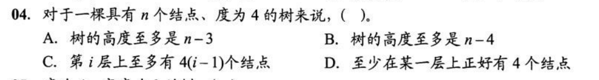
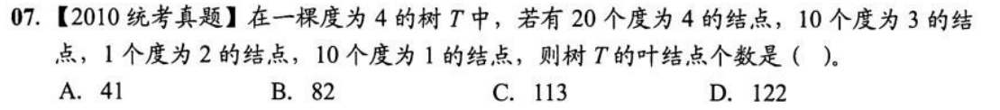
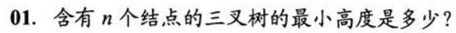
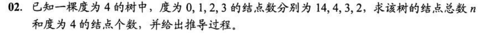
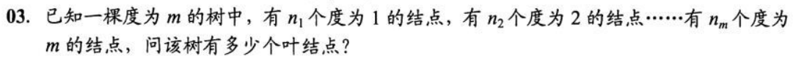
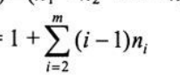

## 5. 树
### 5.1 树的概念

度为4 高度最大 则其他结点都为1个，子树4 个， 所以 最大高度 = n-4+1=n-3
C 至多有 4^(i-1) 个结点

结点数 = 分支数 + 1
分支数 = 结点度之和  1 + n1 + 10n3+ 2n2 + 20n4 = n0 + n1 + n2 + n4

log3 (2n+1)
满 三叉树（m^（h-1） - 1）/（m-1）  < n <=（m^h - 1）/（m-1）  =
[logm n(m-1) + 1]  <= h < logm (n(m-1) + 1) +1
amend

结点数 = 度数和+1   14 + 4 + 3 + 2 + n4 = 0 + 4*1 + 2*3 + 3*2 + 4*n4 + 1
n4 = 2

n1 + n2 + nm + n0 = n1 + 2n2 + mnm +1
n0 = n2 + 2n3 +3n4 + (m-1)nm + 1 = 1 + 

### 5.2 二叉树